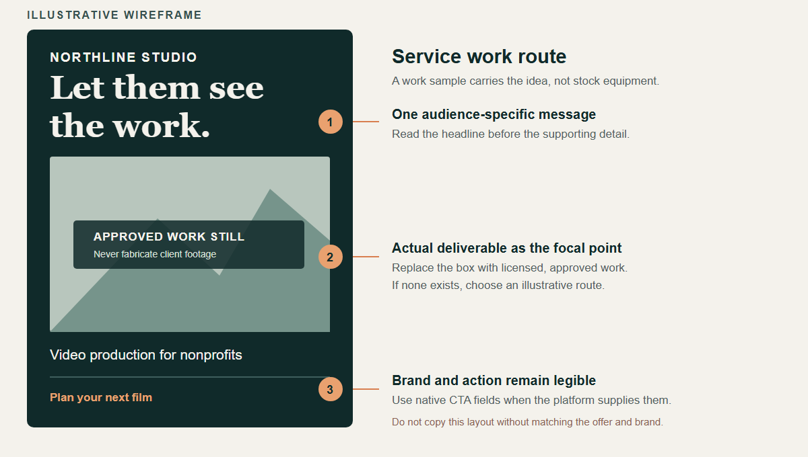
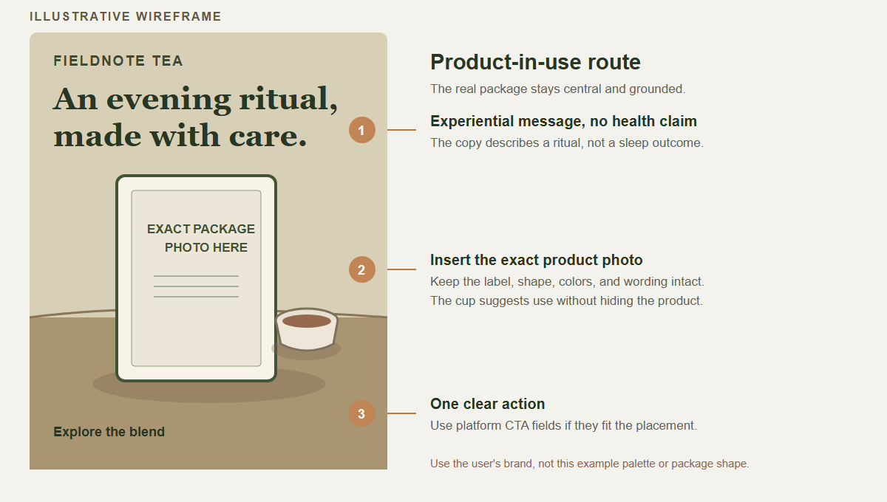

# Annotated visual examples

These are original wireframes, not ads with measured results and not templates to reproduce. Open the PNG that matches the task. The SVG files beside them are editable sources. Keep the decision behind the composition, then use the user's brand and actual assets.

## Service without a physical product

The example uses an approved work still as the visual anchor. It gives the viewer a clear service category and a short reason to care. If no real still exists, do not render fake client footage into the empty box. Change the route or use an openly illustrative treatment. A generic camera would describe the equipment, not what the client receives.

## Product with exact packaging

The product remains the focal point and sits in a believable use setting. The package image and logo are exact assets; the background may be generated. The copy suggests an evening ritual without promising a sleep or health result. A product photo is not a license to invent its label, ingredients, or reviews.
