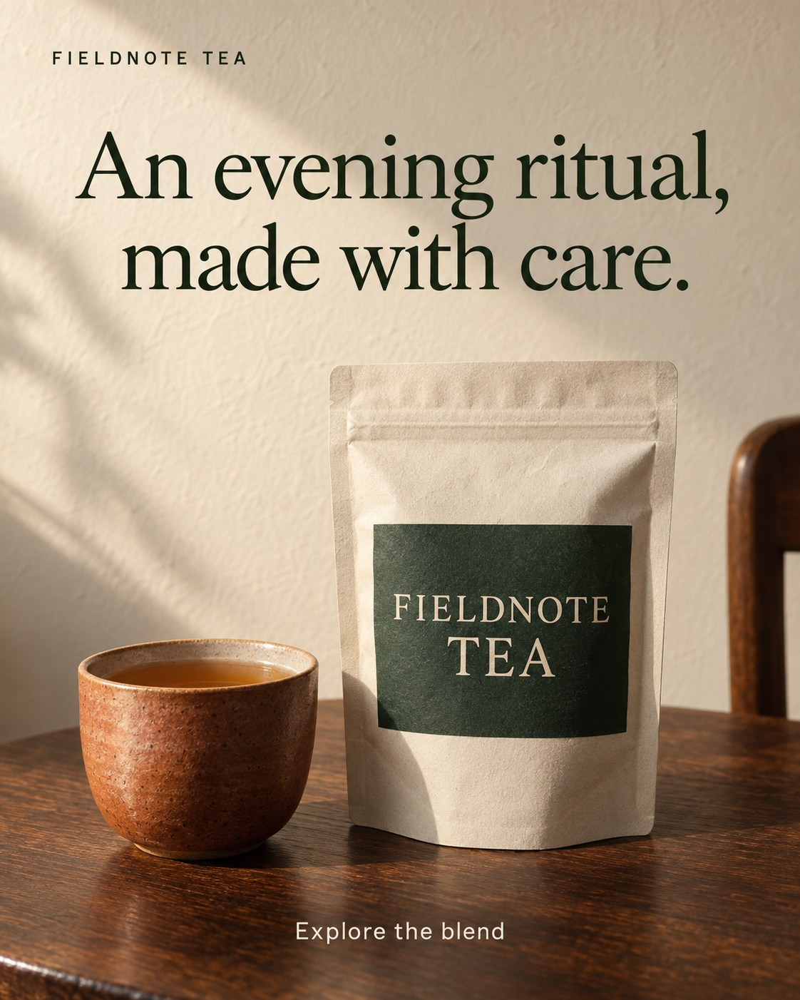

# Original teaching example: product

Fieldnote Tea is a fictional product brand built around an evening tea ritual. The headline names the moment, then the pouch and cup make it concrete. The pouch stays large and unobscured. Its flat label, folds, and contact shadow give it weight on the table. The cup shows how to use the tea without hiding the package.

Warm side light separates paper, ceramic, and wood. Dark green serif type reads against the quiet wall. The package label shares the headline's color, so the brand cue is part of the composition. This is a deliberately calm treatment. A playful or practical brand may need another pace and type style.

The useful decisions are to show a relevant use moment, preserve readable package detail, and set a clear reading order. Do not infer sleep or health benefits from the evening scene. For a real product, use the supplied package and check its label against the source.

This generated package does not demonstrate asset fidelity. For a Google responsive image asset, make a separate version without the added headline, studio-style wordmark, or action line, and provide those elements through the appropriate fields.

This is an original fictional teaching image. It has no measured campaign performance. Do not treat its fictional package, palette, type, or layout as a real brand reference.
