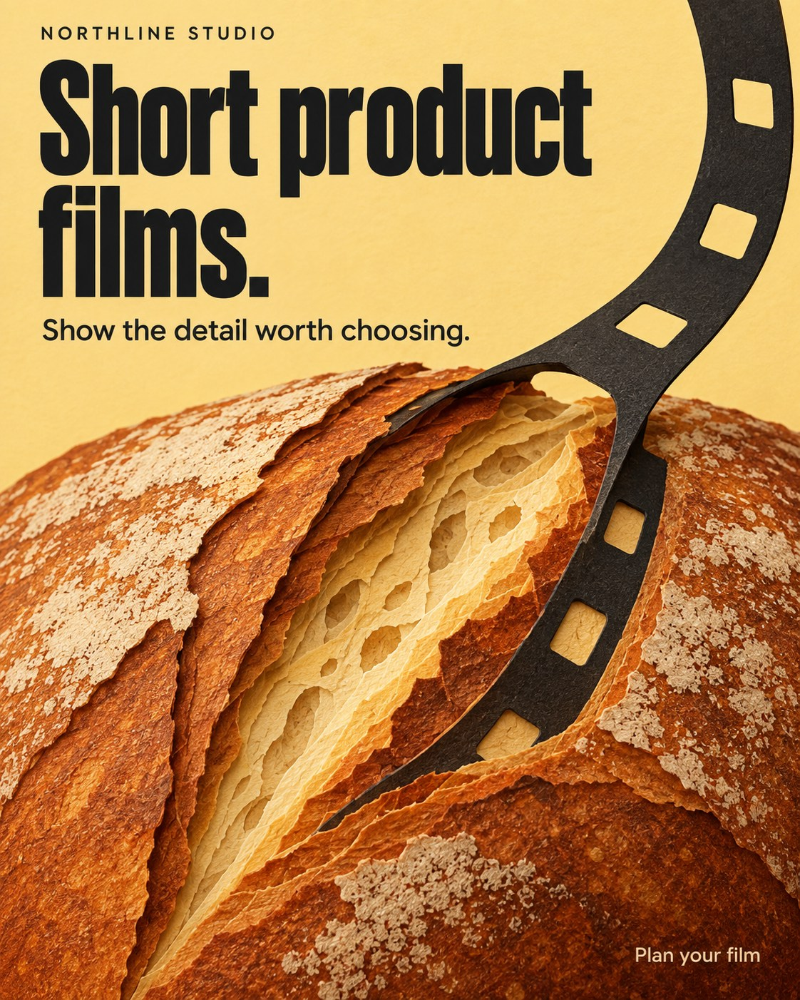

# Original teaching example: service

Northline Studio is a fictional service that makes short product films for independent food makers. Its benefit is making product detail noticeable. The headline names the service before the bread image can read as a bakery ad.

The close crop gives the bread texture room. A dark film strip curls into the scored loaf, joining film and food in one impossible construction. The large condensed headline and warm paper palette belong to this fictional studio's identity. The strip also connects the type area to the cut in the loaf.

The useful decision is to connect what the service does with the customer's subject. A camera on a desk would identify equipment, but would say less about what the food maker receives. Another studio may need a different medium, palette, or subject. Use the offer and the real brand identity to decide.

The image mixes bread photography with a paper-like interior, so it does not meet a strict flat-paper-cut brief. The film strip is a visual metaphor, not a literal production method or client-work sample. Its small action line would need more size or weight for feed use, or the placement's native CTA can carry the action. This example teaches service clarity and composition, not exact medium compliance.

This is an original fictional teaching image. It has no measured campaign performance. Do not treat its fictional work, palette, type, or layout as a real brand reference.
